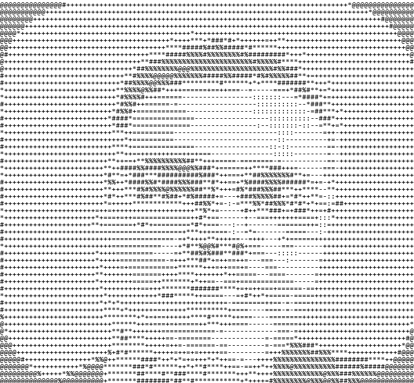

# Paluh

## Início

Privacidade Aluh tem como objetivo o desenvolvimento de aplicação para a descoberta e anonimização (tarjamento) de dados pessoais em documentos textuais no formato PDF.

Início 11/05/2024.

Paluh é construído utilizada as seguintes bibliotecas:

1.  Interface Gráfica com o Usuário
    - Tkinter ttkbootstrap : <https://ttkbootstrap.readthedocs.io/en/latest/>
2.  Manipulação de PDF
   -  PymuPDF : <https://pymupdf.readthedocs.io/en/latest/>

## Considerações:

Paluh é uma ferramenta experimental em desenvolvimento. Não há garantias sobre o correto funcionamento.

## Funcionalidades em implantação:

1. Txxxx
    - <b><s>Início: 30/04/2024-Fim: 03/05/2024.</s></b>

## Instruções de uso:

## Licença BSD-3-Clause 

BSD 3-Clause License

Copyright (c) 2024-2025, Inc. 2024-2025, Albert França Josuá Costa.
All rights reserved.

Redistribution and use in source and binary forms, with or without
modification, are permitted provided that the following conditions
are met:

1. Redistributions of source code must retain the above copyright
   notice, this list of conditions and the following disclaimer.

2. Redistributions in binary form must reproduce the above
   copyright notice, this list of conditions and the following
   disclaimer in the documentation and/or other materials provided
   with the distribution.

3. Neither the name of the copyright holder nor the names of its
   contributors may be used to endorse or promote products derived
   from this software without specific prior written permission.

THIS SOFTWARE IS PROVIDED BY THE COPYRIGHT HOLDERS AND CONTRIBUTORS
"AS IS" AND ANY EXPRESS OR IMPLIED WARRANTIES, INCLUDING, BUT NOT
LIMITED TO, THE IMPLIED WARRANTIES OF MERCHANTABILITY AND FITNESS FOR
A PARTICULAR PURPOSE ARE DISCLAIMED. IN NO EVENT SHALL THE COPYRIGHT
OWNER OR CONTRIBUTORS BE LIABLE FOR ANY DIRECT, INDIRECT, INCIDENTAL,
SPECIAL, EXEMPLARY, OR CONSEQUENTIAL DAMAGES (INCLUDING, BUT NOT
LIMITED TO, PROCUREMENT OF SUBSTITUTE GOODS OR SERVICES; LOSS OF USE,
DATA, OR PROFITS; OR BUSINESS INTERRUPTION) HOWEVER CAUSED AND ON ANY
THEORY OF LIABILITY, WHETHER IN CONTRACT, STRICT LIABILITY, OR TORT
(INCLUDING NEGLIGENCE OR OTHERWISE) ARISING IN ANY WAY OUT OF THE USE
OF THIS SOFTWARE, EVEN IF ADVISED OF THE POSSIBILITY OF SUCH DAMAGE.

## Contato

Albert França Josuá Costa

 <albertfrancajosuacosta@gmail.com>

 <https://www.linkedin.com/in/albert-josu%C3%A1-9aa550239/>

## Distintivos

 

## Quem é Aluh?

